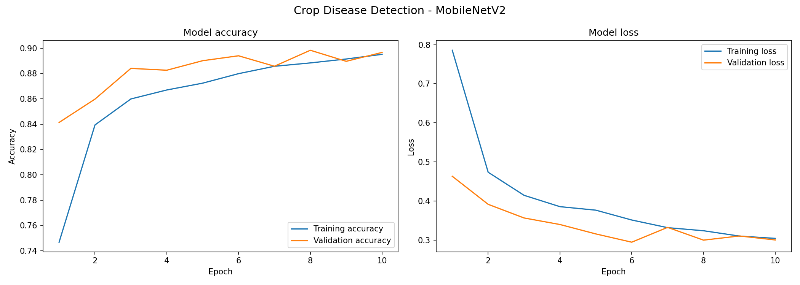
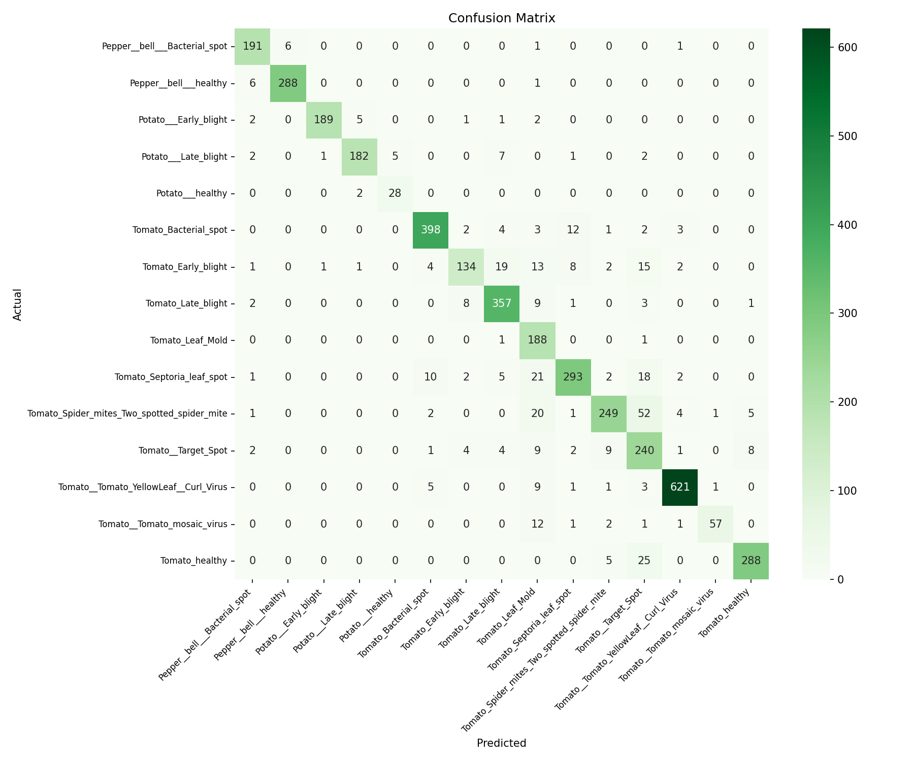

# 🌱 Crop Disease Detection Using Deep Learning

A deep learning-based web application that detects crop diseases from leaf images using MobileNetV2 and Transfer Learning. Built as a 4th Semester Machine Learning project at UET Peshawar.

---

## 📌 Project Overview

Agriculture contributes nearly 19% to Pakistan's GDP, yet farmers lose significant crops every year due to undetected diseases. This project provides an AI-powered solution where a user simply uploads a photo of a crop leaf and instantly receives a disease diagnosis with a confidence score — no expert knowledge required.

---

## 🎯 Results

| Metric | Value |
|--------|-------|
| Validation Accuracy | 89.84% |
| Macro F1 Score | 0.89 |
| Total Classes | 15 |
| Total Images | 20,638 |
| Training Epochs | 10 |

---

## 🌿 Supported Crops & Diseases

| Crop | Disease Classes |
|------|----------------|
| 🫑 Pepper | Bacterial Spot, Healthy |
| 🥔 Potato | Early Blight, Late Blight, Healthy |
| 🍅 Tomato | Bacterial Spot, Early Blight, Late Blight, Leaf Mold, Septoria Leaf Spot, Spider Mites, Target Spot, YellowLeaf Curl Virus, Mosaic Virus, Healthy |

---

## 🛠️ Tech Stack

| Tool | Purpose |
|------|---------|
| Python 3.10 | Programming Language |
| TensorFlow / Keras | Model Building & Training |
| MobileNetV2 | Pretrained CNN Architecture |
| Transfer Learning | Fine-tuning on PlantVillage |
| TensorFlow Lite | Model Export & Deployment |
| Streamlit | Web Application |
| Google Colab T4 GPU | Model Training |
| Anaconda | Environment Management |

---

## 🏗️ Project Structure

crop_disease_app/

app.py                        # Streamlit web application

crop_disease_model.tflite     # Trained TFLite model

class_names.json              # Disease class names

training_curves.png           # Accuracy and loss graphs

confusion_matrix.png          # Confusion matrix heatmap

---

## 🚀 How to Run Locally

**Step 1 — Clone the repository:**
```bash
git clone https://github.com/24pwai0013-dev/Crop-Disease-Detection.git
cd Crop-Disease-Detection
```

**Step 2 — Create and activate environment:**
```bash
conda create -n cropapp python=3.10 -y
conda activate cropapp
```

**Step 3 — Install dependencies:**
```bash
pip install streamlit tensorflow pillow numpy
```

**Step 4 — Run the app:**
```bash
streamlit run app.py
```

**Step 5 — Open in browser:**

http://localhost:8501

---

## 📊 Training Curves



---

## 📉 Confusion Matrix



---

## ⚙️ Model Architecture

- **Base Model:** MobileNetV2 pretrained on ImageNet (1.4M images)
- **Frozen Layers:** 154 (pretrained MobileNetV2 base)
- **Trainable Layers:** 4 (custom classification head)
- **Trainable Parameters:** ~166,543
- **Custom Head:** GlobalAveragePooling → Dropout(0.3) → Dense(128, ReLU) → Dense(15, Softmax)
- **Optimizer:** Adam (lr=0.001)
- **Loss Function:** Categorical Crossentropy

---

## ⚠️ Limitations

- Trained on controlled lab images — may perform differently on real field images
- Covers only 3 crop types (tomato, potato, pepper)
- Does not estimate disease severity
- Tomato Late Blight and Potato Late Blight may occasionally be confused due to identical visual symptoms caused by the same pathogen
- Requires local Python environment to run

---

## 🔮 Future Work

- Expand to Pakistani crops like wheat, rice, and cotton
- Add disease severity estimation
- Convert to Android mobile application using TFLite
- Deploy as a public web service for farmers

---

## 👨‍💻 Author

- **Muhammad Muzammil Farooq**

**Department of Computer Science**
**University of Engineering & Technology, Peshawar, Pakistan**
**June 2026**

---

## 📚 Dataset

[PlantVillage Dataset on Kaggle](https://www.kaggle.com/datasets/emmarex/plantdisease)

---

## 📄 License

This project is for academic purposes only.
